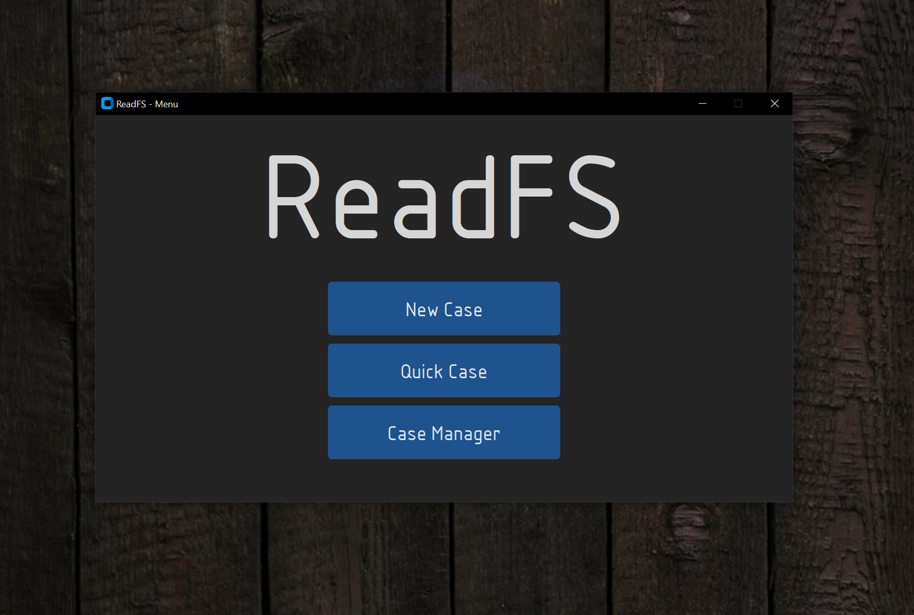
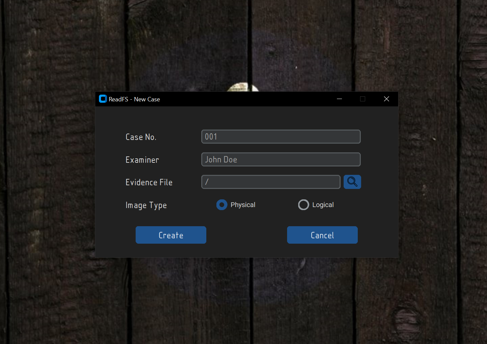
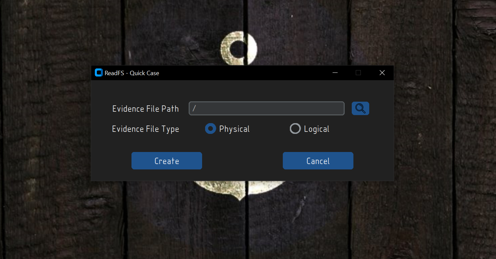
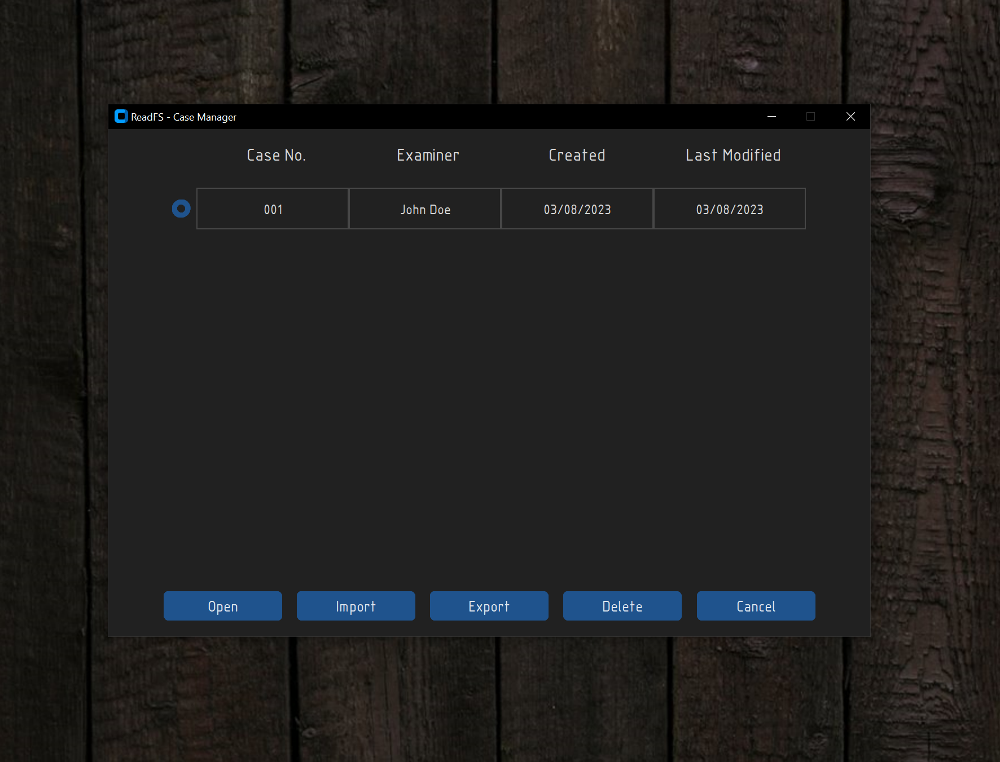

# About the project

This project started after I learned that Microsoft has developed a new file system that removes some limitations that NTFS has and deals better with data corruption. After looking around to see if there are any tools or pieces of software that can parse this type of file system I could only find 5 products which have support for ReFS but I think those tools can be improved. 

With that said, this project aims to fit the needs of a day-to-day user and help out with data loss recovery and forensics investigations. The plan is to build a console-based utility for windows or linux that will help forensic investigators parse ReFS formated disks images created by FTK Imager.

# Giving credit where credit is due

This project wouldn't be possible or would be really hard to accomplish without the help of a paper written by Paul Prade, Tobias Groß, Andreas Dewald from Friedrich Alexander University
Erlangen-Nuremberg. Please feel free to go and read their amazing [paper](https://doi.org/10.25593/issn.2191-5008/CS-2019-05). 


# After cloning the repo
After cloning the repo you will need to install the dependencies. To do that you will need to run the following command:
```cmd
$> pip install -r requirements.txt
```


# GUI Usage
As of now the GUI is still in development, and it's not ready for use. This means that there is currently no functionality tied to the GUI.
The GUI is built using the [customtkinter](https://github.com/TomSchimansky/CustomTkinter) library, and it's prone to massive changes in the future.

To run the gui you will need to run the following command:
```cmd
$> py readfs-gui.py
```

After running this command this window should pop up:


Clicking on the "New Case" button will open a new window where you will be able to create a new case. It is important to note
that this action, in the future, will create a full environment for the case, including a database and a folder structure.


Clicking on the "Quick Case" button will open a new window where you will be able to open a temporary case. This means that after
closing the app, all the data will be lost. The idea behind this option is to allow the user to quickly parse a ReFS image without having to create a new case.


Clicking on the "Case Manager" button will open a new window where you will be able to manage all the cases that you have created. 
This includes open, import, export and delete cases. As of now, for showcasing purposes only the "Import" and "Delete" buttons are working.
Clicking any other buttons will reopen the menu window.



# CLI Usage
# Current capabilities
- The ability to correctly parse and output information from the following:
    - Boot sector
    - Superblock
    - Checkpoint
    - Nodes

## Bootsector
To display general information about the forensic image you will need to pass the -ii or --image_info flags. See the example bellow:
```cmd
$> py readfs.py -f path/to/file.001 -ii
```
```
<<=====================[Boot Sector]=====================>>
[+] ReFS Version: 3.4
[+] Super Block Offset: 1966080 bytes
[+] VBR Size: 512 bytes
[+] Bytes per Sector: 512
[+] Cluster size: 65,536 bytes
[+] Sectors per Cluster: 128
[+] Clusters per Container: 1,024
[+] Number of Containers: 80
[+] Number of Clusters: 81,920
[+] Number of Sectors: 10,485,760
[+] Container size: 67,108,864 bytes
[+] Volume size: 5,368,709,120 bytes
[+] Volume Serial Number: CA820A8B820A7BE7
<<=======================================================>>
```
## Superblock
The information stored in the Superblock structure can be extracted using the command bellow:

```cmd
$> py readfs.py -f path/to/file.001 -bi superblock
```
```
<<=====================[Page Header]=====================>>
[+] Page Signature: SUPB
[+] Volume Signature: 9FE57C04
[+] LCN_0: 30
[+] LCN_1: 0
[+] LCN_2: 0
[+] LCN_3: 0
[+] Table Type: Not A Table
<<======================[Superblock]=====================>>
[+] GUID: 9FE57C04
[+] Superblock Version: 1
[+] Checkpoint Reference Number: 2
[+] Checkpoint1 Offset: 55967744 bytes
[+] Checkpoint2 Offset: 646316032 bytes
[+] Self Descriptor Relative Offset: 208 bytes
[+] Self Descriptor Length: 104 bytes
<<================[Self Page Descriptor]=================>>
[+] LCN_0: 30
[+] LCN_1: 0
[+] LCN_2: 0
[+] LCN_3: 0
<<=================[Page Checksum Info]==================>>
[+] Checksum Type: CRC64-ECMA-182
[+] Checksum Offset: 8
[+] Checksum Length: 8
[+] Page Checksum: 84D80F0E0763B9FA
<<=======================================================>>
```
## Checkpoint
The information stored in the Checkpoint can be extracted using the command bellow:
```cmd
$> py readfs.py -f path/to/file.001 -bi checkpoint
```
```
<<=====================[Page Header]=====================>>
[+] Page Signature: CHKP
[+] Volume Signature: 9FE57C04
[+] LCN_0: 854
[+] LCN_1: 0
[+] LCN_2: 0
[+] LCN_3: 0
[+] Table Type: Not A Table
<<======================[Checkpoint]=====================>>
[+] ReFS Version: 3.4
[+] Self Descriptor Relative Offset: 208
[+] Self Descriptor Length: 104
[+] Checkpoint Virtual Clock: 16
[+] Allocator Virtual Clock: 12
[+] Oldest Log Record: 0
<<==============[Pointers Info and Offsets]==============>>
[+] Number Of Pointers: 13
[+] Object ID Table: 4587520
[+] Duplicate Object ID Table: 34013184
[+] Medium Allocator Table: 36700160
[+] Container Allocator Table: 3145728
[+] Schema Table: 2949120
[+] Duplicate Schema Table: 3014656
[+] Parent Child Table: 2883584
[+] Block Reference Count Table: 3342336
[+] Container Table: 100663296
[+] Duplicate Container Table: 100859904
[+] Container Index Table: 2686976
[+] Integrity State Table: 3276800
[+] Small Allocator Table: 67108864
<<================[Self Page Descriptor]=================>>
[+] LCN_0: 854
[+] LCN_1: 0
[+] LCN_2: 0
[+] LCN_3: 0
<<=================[Page Checksum Info]==================>>
[+] Checksum Type: CRC64-ECMA-182
[+] Checksum Offset: 8
[+] Checksum Length: 8
[+] Page Checksum: FC9AF7DD91EAE85F
<<=======================================================>>
```
## Node
General Node information can be displayed by passing the offset to a table found in the checkpoint. Let's take the Object ID Table pointer offset for example:
```cmd
$> py readfs.py -f path/to/file.001 --node 4587520 --info
```
```
<<=====================[Page Header]=====================>>
[+] Page Signature: MSB+
[+] Volume Signature: 9FE57C04
[+] LCN_0: 4166
[+] LCN_1: 0
[+] LCN_2: 0
[+] LCN_3: 0
[+] Table Type: Object ID
<<=================[Index Root Element]==================>>
[+] Size: 552
[+] Root Fixed Size: 40
[+] Table Schema 1 Identifier: E030
[+] Table Schema 2 Identifier: E030
[+] Table Rows Number: 115
[+] Number of Extents: 0
<<====================[Index Header]=====================>>
[+] Node Type: Root
[+] Node Height: 0
[+] Start Of Data Area: 40
[+] End Of Data Area: 32160
[+] Key Index Start: 64444
[+] Key Index End: 64904
[+] Key Index Entries: 115
[+] Node Free Bytes: 32284
<<=======================================================>>
```
Every table found in the Checkpoint Block has entries/rows in them, those can be extracted by using the --entries flag and specify the output format (--table or --json):
```cmd
$> py readfs.py -f path/to/file.001 --node 4587520 --entries --table
```
```
+-----+------------+------------+----------+---------+--------------+------------+------------+--------------------------+------------+---------------+---------------+-------------+-----------------+
| Nr. | Entry size | Key Offset | Key Size |   Flag  | Value Offset | Value Size | Table Type |            ID            | LSN Offset | Buffer Offset | Buffer Length | Durable LSN |  Page Reference |
+-----+------------+------------+----------+---------+--------------+------------+------------+--------------------------+------------+---------------+---------------+-------------+-----------------+
|  1  |    272     |     16     |    16    | Not Set |      32      |    240     | Object ID  |       Upcase dup.        |     24     |      200      |       0       |    (0, 0)   | (4143, 0, 0, 0) |
|  2  |    272     |     16     |    16    | Not Set |      32      |    240     | Object ID  |          Upcase          |     24     |      200      |       0       |    (0, 0)   | (4144, 0, 0, 0) |
|  3  |    272     |     16     |    16    | Not Set |      32      |    240     | Object ID  | Logfile Information dup. |     24     |      200      |       0       |    (0, 0)   | (4153, 0, 0, 0) |
|  4  |    272     |     16     |    16    | Not Set |      32      |    240     | Object ID  |   Logfile Information    |     24     |      200      |       0       |    (0, 0)   | (4154, 0, 0, 0) |
|  5  |    272     |     16     |    16    | Not Set |      32      |    240     | Object ID  |       Trash Stream       |     24     |      200      |       0       |    (1, 0)   | (4157, 0, 0, 0) |
[...snip...]
```
There is a flag that permits single entry output because there may occasionally be too many entries to view in the console.
```cmd
$> py readfs.py -f path/to/file.001 --node 4587520 --entry 4 --json
```
```
{'Entry size': 272, 'Key Offset': 16, 'Key Size': 16, 'Flag': 'Not Set', 'Value Offset': 32, 'Value Size': 240, 'Object ID': {'ID': 'Trash Stream', 'LSN Offset': 24, 'Buffer Offset': 200, 'Buffer Length': 0, 'Durable LSN': (1, 0), 'Page Reference': (4157, 0, 0, 0)}}
```
### Note
- The --table and --json flags are working for the following tables:
    * `Object ID Table`
    * `Schema Table`
    * `Container Table`
    * `Parent Child Table`
    * `Object ID Table (dup.)`
    * `Schema Table (dup.)`
    * `Container Table (dup.)`
- Support will be added for the following tables/nodes:
    * `All Allocator Tables (Small, Medium, Container)`
    * `Block Reference Count`
    * `Container Index Table`
    * `Integrity State Table`
- I'd suggest to set the console width to 200 to be able to see the tables fully
- The tables that populate the nodes have different structures so the output will be different for enery table, excluding the duplicates as they have the same structure as their parents.

# What's next?
- Adding support for the rest of the tables in the file system.
- Implementing ways to view the files/folders present in the forensic image. (Deleted or not)
- Adding the ability to recover deleted or non-deleted files/folders from the forensic image.
